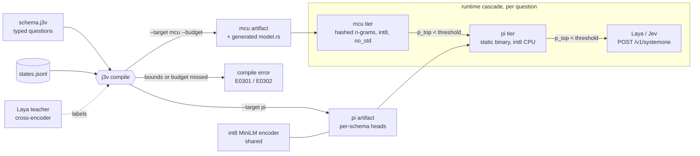

# J3v

**J3v is to Jev as k3s is to k8s: calibrated System One decisions, compiled for the edge.**

[](https://github.com/JGalego/J3v/actions/workflows/ci.yml)
[](LICENSE)
[](https://www.rust-lang.org)
[](#architecture)

J3v is a **compiler**. You give it a schema of typed questions (`choice`, `score`, `noul`) and their allowed
answers. It distills [Laya](https://huggingface.co/convaiinnovations/laya) into an artifact for one target,
fits temperature scaling, and **refuses to emit** an artifact that misses its accuracy/ECE bounds or its
flash/RAM budget. It returns calibrated probabilities, never text, and speaks Laya's `POST /v1/systemone` shape.

## Getting Started

```bash
cargo build --release                         # j3v: compiler driver + pi runtime (one binary)
pip install torch transformers safetensors huggingface_hub   # compile time only

# shared int8 encoder for the pi target
./target/release/j3v encoder import path/to/all-MiniLM-L6-v2 -o minilm.j3a

# states to distill on (JSONL: {"id", "state", "labels"?}); the example uses the Bitext support corpus
python3 examples/support_triage/prepare.py bitext.csv states.jsonl 8000

# compile for a Raspberry Pi-class device, then for a microcontroller with a 512 KB flash budget
./target/release/j3v compile schemas/support_triage.j3v --target pi  --encoder minilm.j3a --states states.jsonl -o triage.pi.j3a
./target/release/j3v compile schemas/support_triage.j3v --target mcu --budget 512KB       --states states.jsonl -o triage.mcu.j3a

# serve (Laya/Jev-compatible)
./target/release/j3v serve --encoder minilm.j3a triage.pi.j3a --addr 0.0.0.0:8000
curl -s localhost:8000/v1/systemone -d '{"state": {"message": "I was charged twice, refund me"}}'
```

A schema:

```text
schema support_triage
teacher laya

choice department "Which department should handle this request?"
  billing  "invoices, payments, refunds"
  shipping "delivery times, addresses"
score urgency "How urgent is this request?"
  "not urgent"
  "critical"
noul refund_requested "Does the user ask to get their money back?"

threshold 0.80            # below this calibrated p_top, escalate to the next tier
require agreement >= 0.85 # checked against 95% bootstrap bounds on held-out states
require ece <= 0.05
```

Static builds: `cargo build --release --target aarch64-unknown-linux-musl` (~1 MB, no C toolchain needed).
Firmware: see [`firmware/cortex-m7`](firmware/cortex-m7) (STM32H743 / QEMU `mps2-an500`).

## Architecture



- **Conformance is the type system.** Calibration (per-question temperature) and the accuracy/ECE gate run in
  Rust on the artifact as shipped, through the same kernels as the runtime.
- **pi:** shared int8 BERT encoder plus distilled per-schema heads. One encoder pass answers every question.
- **mcu:** one model per schema. Hashed byte n-grams feed an int8 MLP, with no vocabulary table and no allocator. The compiler searches model sizes under the budget.
- Design notes: [Step 0 report on Laya](docs/step0-laya-report.md).

## License

[MIT](LICENSE) © João Galego
