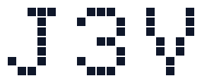
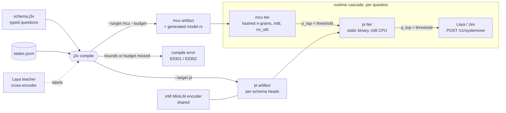

<p align="center">
  <picture>
    <source media="(prefers-color-scheme: dark)" srcset="docs/logo-dark.svg">
    
  </picture>
</p>

<p align="center">
  <strong>J3v is to Jev as k3s is to k8s: calibrated System One decisions, compiled for the edge.</strong>
</p>

<p align="center">

[](https://github.com/JGalego/J3v/actions/workflows/ci.yml)
[](LICENSE)
[](https://www.rust-lang.org)
[](#architecture)

</p>

J3v is a **compiler**. You give it a schema of typed questions (`choice`, `score`, `noul`) and their allowed
answers. It distills [Laya](https://huggingface.co/convaiinnovations/laya) into an artifact for one target,
fits temperature scaling, and **refuses to emit** an artifact that misses its accuracy/ECE bounds or its
flash/RAM budget. It returns calibrated probabilities, never text, and speaks Laya's `POST /v1/systemone` shape.

## Getting Started

**1. Install** (Linux: x86_64, 64-bit ARM, or 32-bit ARM such as a Raspberry Pi). The installer verifies checksums;
`J3V_VERSION` pins a release, and `J3V_INSTALL_DIR` changes the install location.

```bash
curl -fsSL https://raw.githubusercontent.com/JGalego/J3v/main/install.sh | J3V_MODELS=j3v-models sh
# or build from source: cargo install --path crates/j3v
```

**2. Try the example** (`J3V_MODELS` above downloaded the shared encoder and the example artifacts):

```bash
j3v predict --encoder j3v-models/minilm.j3a j3v-models/support_triage.pi.j3a '{"state": {"message": "refund me"}}'
j3v serve j3v-models/support_triage.pi.j3a --encoder j3v-models/minilm.j3a
```

**3. Compile your own schema** (needs the repo and Python, at compile time only):

```bash
pip install -r compiler/requirements.txt
j3v compile schemas/support_triage.j3v --target pi --encoder j3v-models/minilm.j3a --states states.jsonl -o triage.j3a
```

A schema declares questions, a confidence threshold for escalation, and the bounds the artifact must meet:

```text
schema support_triage
choice department "Which department should handle this request?"
  billing  "invoices, payments, refunds"
  shipping "delivery times, addresses"
noul refund_requested "Does the user ask to get their money back?"
threshold 0.80
require ece <= 0.05
```

## Architecture



- **Conformance is the type system.** Calibration (per-question temperature) and the accuracy/ECE gate run in
  Rust on the artifact as shipped, through the same kernels as the runtime.
- **pi:** shared int8 BERT encoder plus distilled per-schema heads. One encoder pass answers every question.
- **mcu:** one model per schema. Hashed byte n-grams feed an int8 MLP, with no vocabulary table and no allocator. The compiler searches model sizes under the budget.
- Design notes: [Step 0 report on Laya](docs/step0-laya-report.md).

## License

[MIT](LICENSE) © João Galego
